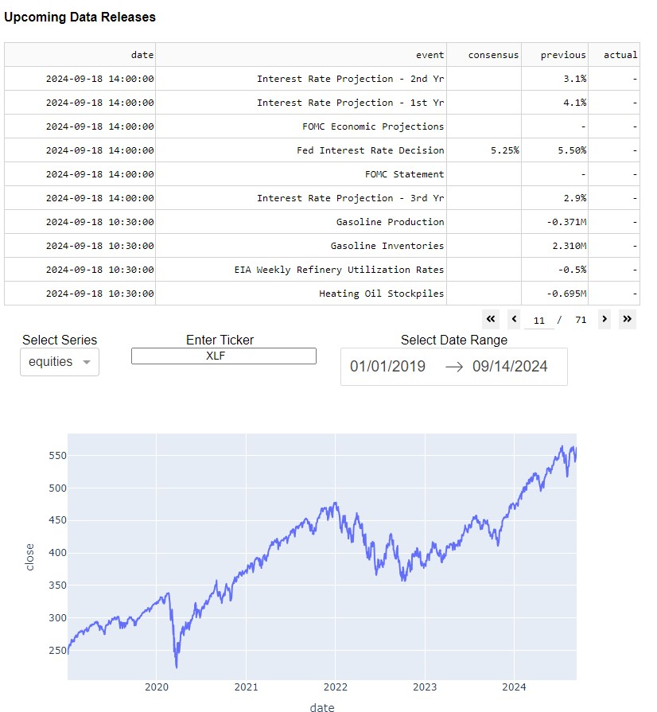

## Dashboard

This is an in-process project where I'm aiming to:

- Access financial and economic data from a number of local and cloud-based sources, using the openbb platform when possible.
- Retrieve data from cloud-based sources and store it locally for simpler and more secure usage (for instance in conjunction with the SCBacktester project)
- Provide a meaningful, intuitive and flexible interface to view, clean, manipulate and analyze data 
- Replace my current piecemeal system of python scripts, notebooks, csv files and excel/power query with something more robust and extensible
- Get some more hands on experience with teh sqlalchemy and dash packages

State as of: 9/15/24

